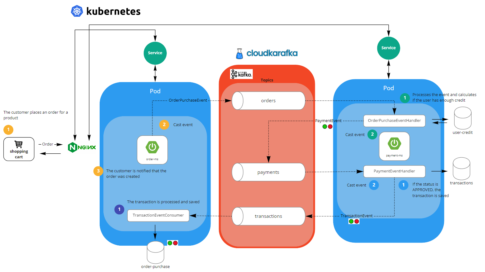

## Choreography Saga Pattern 

An example on Payment Microservices

### Implemented with 
- Spring Cloud Stream with Apache Kafka Binder
- Spring WebFlux
- Leveraging Netty's non-blocking server model

Operations persisting to the database have a dedicated, well-tuned thread pool as it can isolate blocking IO calls separately from the application.

### System Design

<p>
    
</p>


#### Data Flow
- The Order Service application takes in an `Order` as a request,
which creates and sends an `OrderPurchaseEvent` to the Kafka topic `orders` which is processed by `OrderPurchaseEventHandler` in the payment service.
- `OrderPurchaseEventHandler` processes the event and calculates if user has enough credit. If so,
it sets the generated `PaymentEvent` status to `APPROVED`, otherwise `DECLINED`.
- A `PaymentEvent` is emitted to the Kafka topic `payments`, which the `PaymentEventHandler` in the Payment Service application
listens for.
- If the `PaymentEvent` status is `APPROVED`, it saves the transaction in the `TransactionRepository`.
A `TransactionEvent` is emitted to the `transactions` topic.
- The `TransactionEventConsumer` reads this in the order service, if successful, the `OrderRepository` saves this as 
`ORDER_COMPLETED`, else `ORDER_FAILED`

### Run

- Run zookeeper and kafka brokers:

```
docker-compose up -d
```

- Run the Order Service and the Payment Service application
- Make a **POST** Request to `localhost:9192/orders` with request body: 

```
{
    "userId": 1,
    "productId": 1
}
```

- Make a **GET** Request to `localhost:9192/orders` and see the order status updated

K8s Design

<p>
    
</p>

- Run manifests:

```
cd manifests
# Install ingress on cluster
kubectl apply -f https://raw.githubusercontent.com/kubernetes/ingress-nginx/controller-v0.41.2/deploy/static/provider/cloud/deploy.yaml
kubectl apply -f .
```

- Make a **POST** Request to `localhost/order/orders` with request body: 

```
{
    "userId": 1,
    "productId": 1
}
```

- Make a **GET** Request to `localhost/order/orders` and see the order status updated